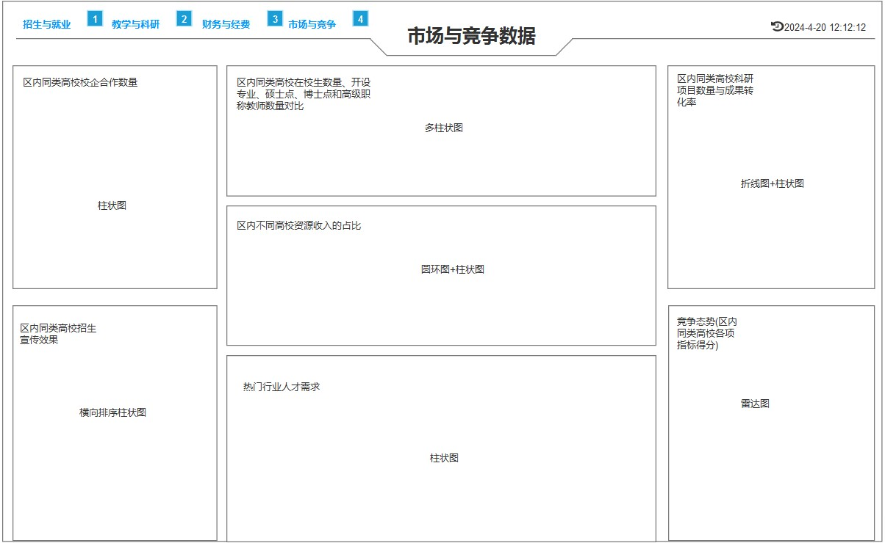

# 东软教育行业数据可视化决策系统

## 一、引言

### 1.1 目的

旨在通过高效的数据可视化工具，将大学核心运营与学术数据转化为直观易懂的图表和界面，以便管理层能够快速洞察关键信息，支撑科学决策过程，提升管理效率与决策精准度。

### 1.2 背景

 在当前信息化时代，高等院校面临日益复杂的数据管理和决策需求。传统的数据分析方法难以满足快速响应和深度洞察的要求。因此，利用先进的数据可视化技术，将海量教育统计数据转变为多维度、交互式的视觉展示，成为了提升高校管理水平的重要手段。本项目致力于构建一个综合性的数据可视化平台，该平台不仅整合全校范围内的关键数据指标，还能够动态展示这些数据，为校方领导及管理人员提供一个全面、实时、可交互的数据视图，辅助他们在招生、教学评估、科研管理等多个领域做出更加明智的策略选择。

### 1.3 参考资料

- 参考指导老师《东软教育行业数据可视化决策系统》
- 百度图片：页面可视化设计。
- 百度文库、百度百科、GPT、维基百科

## 二 、系统开发需求规定

## 2.1 系统开发目标

- 设计直观易懂的数据可视化界面，包括图表、仪表盘等。
- 支持多种数据展示方式，如柱状图、饼图、折线图、雷达图等，以满足不同用户的需求。
- 提供互动式的数据浏览和分析功能，用户可以自由筛选和查看感兴趣的数据。
-  帮助教育管理者发现问题、优化资源配置、提升教育质量。 
-  确保系统界面友好，操作简单，易于使用。 

## 2.2 需求分析

### 2.2.1 非功能性需求

- 完全的浏览器在线操作模式，无需安装、操作方便，具有良好的系统扩充能力。
- 可跨学科应用：也就是说：将来可以与基于Python的人工智能连接，对统计数据进行分析、预测，并显示在可视化大屏上。比如：下一年度招生与就业预测
-  建立严格的数据安全管理机制，确保数据的保密性和完整性。 
-  符合相关法律法规，保护用户的隐私和数据安全。 

### 2.2.2 系统功能性需求

作为一个大学校长，在做任何决策时，必然要依据大量的统计数据。现在有了数据可视化技术，就可以将统计数据以可视化图表的形式展示。本系统就是对院校重要数据进行统计分析后，以多屏可视化的形式展现，提供给管理者作为决策的依据。

**1、 大屏1：招生与就业数据**

​招生人数、招生来源、录取平均分等，反映学校的生源质量和吸引力。

毕业生就业率、就业行业分布、薪资水平等，体现学校的教育质量和人才培养效果。

**2、 大屏2：教学与科研数据**

​学生满意度调查、教学质量评价等，揭示教学水平和效果。

教师科研成果、科研项目数量、经费使用情况等，反映学校的科研实力和投入。

**3、 大屏3：财务与经费数据**

​学校经费收入与支出情况、预算执行情况等，确保资金的有效利用和财务健康。

各类资源的分配和利用情况，如教室、实验室、图书馆等，为资源优化提供依据。

**4、 大屏4：市场与竞争数据**

​同类高校的发展状况、招生策略、科研成果等，了解竞争态势。

社会需求与行业发展趋势，为学校定位和发展提供方向。

### 2.2.3 系统用例图


## 三、页面原型设计

### 3.1  招生与就业数据大屏 
![[images/Pasted image 20240703104259.png]]
#### 3.1.1  近5年招生情况  

柱状图：展示学校近5年的招生整体情况，分为：招生人数、录取人数。

横坐标：根据年份分类，比如：2019、2020、2021、2022、2023。

纵坐标：人数。

注：每年都需要展示招生人数、录取人数。

#### 3.1.2  近5年招生人数

饼图：展示学校近五年的招生人数，分为：高职、本科、硕士。  

#### 3.1.3 招生人数概览

模块一（文本展示）：数据总数统计展示包括：录取总人数、报名总人数。

模块二（地图）：每个省份的录取总人数、报名总人数（获得焦点展示）。

#### 3.1.4 近5年录取平均分数

折线图：展示学校近五年的招生平均分数，分为：高职、本科、硕士

横坐标：根据年份分类，比如：2019、2020、2021、2022、2023

纵坐标：分数

注：每年都需要展示招生平均分数

#### 3.1.5 各专业招生人数

柱形图：展示各专业招生人数，分为：高职、本科、硕士。

横坐标：根据专业分类，比如：计算机科学、软件工程、土木工程、建筑学、机械工程、生物科学、工程力学、城乡规划、化学工程、电气工程。

纵坐标：人数。

注：每年都需要展示高职、本科、硕士的各专业招生人数。

#### 3.1.6 就业行业分布

饼图：展示学校学生就业行业分布，分为：信息技术、金融、教育、医疗保健、制造业、零售与消费品、媒体与娱乐、能源与环境、建筑与房地产、交通运输与物流。

#### 3.1.7  近5年各专业就业人数及就业率  

模块一（柱形图）： 展示近5年各专业就业人数，分为：计算机科学、软件工程、土木工程、建筑学、机械工程、生物科学、工程力学、城乡规划、化学工程、电气工程。

横坐标：根据专业分类，比如：计算机科学、软件工程、土木工程、建筑学、机械工程、生物科学、工程力学、城乡规划、化学工程、电气工程

纵坐标：人数。

注：每年都需要展示计算机科学、软件工程、土木工程、建筑学、机械工程、生物科学、工程力学、城乡规划、化学工程、电气工程的各专业就业人数。

模块二（折线图）：展示近5年各专业就业率，分为：计算机科学、软件工程、土木工程、建筑学、机械工程、生物科学、工程力学、城乡规划、化学工程、电气工程。

横坐标：根据专业分类，比如：计算机科学、软件工程、土木工程、建筑学、机械工程、生物科学、工程力学、城乡规划、化学工程、电气工程。

纵坐标：百分比。

注：每年都需要展示计算机科学、软件工程、土木工程、建筑学、机械工程、生物科学、工程力学、城乡规划、化学工程、电气工程的各专业就业率。统计高职、本科、硕士在上述专业的就业情况

#### 3.1.8  薪资水平分布  

饼图：展示学生就业的薪资水平分布情况，分为：0-2000、2000-4000、4000-6000、6000-8000、8000-10000。

### 3.2  教学与科研数据大屏  

#### 2.2.1 学生教学评价各个维度满意度评分

雷达图：展示近五年学生教学评价各个维度满意度的评分，如课程内容、教师素质、学习方法、教学资源、学习环境。各项满分为20，总分满分为100分。

#### 2.2.2 学生对老师评价关键词

词云图：通过关键词词云图，可以直观地看到学生对老师评价中最常提到的关键词。这有助于了解学生对教师的普遍看法和关注点，帮助教师改进教学方法和提高教学质量。

#### 2.2.3 近5年各学院学生省级及以上各类竞赛奖励情况

柱形图：近5年各学院学生省级及以上各类竞赛奖励情况，分为：启迪数字学院、计算机科学与技术学院、自动化学院、马克思主义学院、外国语学院、经济与管理学院、理学院、国际教育学院。

横坐标：根据学院分类，同时奖项分为省级和国家级。

纵坐标：获奖次数。

注：每年都需要展示各学院的学生学科竞赛的获奖次数。

#### 2.2.4 教学与科研数据概况

鼠标滑动到某个数据的时候，展示相应数据的饼图

联动和共享数据集+文本+饼图

文本有获得焦点后放大效果，并替换相应的饼图。

模块一（文字）：

1.师资规模（个数）：助教、讲师、资深讲师、副教授、教授

2.教师学历分布：博士、硕士、学士、无学士

3.教师年龄占比：35岁以下、36-45岁、46-55岁、56岁以上

模块二（饼图）：

展示相应的饼图，分别为对应的文字的内容的数量。

#### 2.2.5 研究项目和经费分布

饼图+引导线：研究项目和经费分布，包含以下五个方面：实验室建设、科研项目资助、人才培养、学术交流、科研成果转化。

实验室建设：展示每年在实验室建设、设备购置上的投入。

科研项目资助：展示不同科研项目的资助情况，如基础研究、应用研究、合作研究等。

人才培养：展示用于培养博士后、研究生及引进高层次人才的经费。

学术交流：展示用于国内外学术交流、会议、合作研究等的经费。

科研成果转化：展示用于科研成果转化、专利申请、技术推广等的经费。


#### 2.2.6 近5年发表论文、科研项目、专利授权的数量

时间轮播图+柱形图：近5年发表论文、科研项目数量、专利授权的数量。

横坐标：根据能反映科研实力的指标分类，分为：发表论文、科研项目数量、专利授权。

纵坐标：数量。

### 3.3  财务与经费数据大屏

### 3.4 市场与竞争数据大屏



#### 3.4.1 区内同类高校校企合作数量

柱状图：利用柱状图展示区内同类高校校企合作数量。

横坐标:学校的名称，如（广科大，桂工，桂电，广西师大，广西民大）。

纵坐标：各个学校与企业合作的数量。

数据来源：各个高校公布的校企合作企业数量。

#### 3.4.2 区内同类高校招生宣传效果

横向下钻柱状图：利用下钻柱状图的主图子图结构来展示不同高校的招生人数所对应的招生渠道宣传效果。

主图：

横坐标：各个高校的招生数量。

纵坐标：高校的名称，如（广科大，桂工，桂电，广西师大，广西民大）。

子图：

横坐标：各个渠道的宣传效果（学生通过该渠道了解到该高校并进入该校的人数）。

纵坐标：渠道名称，如（校友宣传 、高中校园宣传、传统媒体报纸、短视频平台、社交媒体推广、学校官网）。

数据来源：各个高校的招生人数和学生了解学校渠道调查结果。

#### 3.4.3 区内同类高校在校生数量、开设专业、硕士点、博士点和高级职称教师数量对比

多柱状图：利用多条柱状图展示不同高校某年在校生数量、开设专业、硕士点、博士点和高级职称教师的数量，能够进行很直观的对比。

横坐标：高校名称+高校在校生数量、开设专业、硕士点、博士点和高级职称教师的数量，如（广西科技大学（高校在校生数量、开设专业、硕士点、博士点和高级职称教师数量））。

纵坐标：各个高校在校生数量、开设专业、硕士点、博士点和高级职称教师的数量。

#### 3.4.4 区内不同高校资源收入的占比

圆环图+柱状图：区内不同高校资源收入的占比情况。

圆环图：用圆环图展示每个高校的资源收入占比

数据项：政府拨款、学费、科研项目、校友捐赠、产业合作、其他的数值（单位万元）

柱状图：用柱状图展示不同高校的资源收入总和。

横坐标：高校名称。

纵坐标：高校的资源收入总和（单位万元）。

数据来源：各个学校的财务收入数据。

#### 3.4.5 热门行业人才需求

下钻柱状图：利用下钻柱状图的主图子图结构来展示不同热门行业人才需求。

主图：展示不同年份的所有热门行业人才需求总和。

横坐标：近五年年份，如（2019、2020、2021、2022、2023）。

纵坐标：所有热门行业人才需求总和。

子图：

横坐标：热门行业的名称，如（人工智能与大数据、互联网与电子商务、新能源与可再生能源、生物医药与健康、半导体与芯片、智能制造与工业、区块链技术与加密货币、航空航天）。

纵坐标：各个热门行业的需求量单位（万人）。

数据来源：就业市场的人才需求数据。

#### 3.4.6 区内同类高校科研项目数量与成果转化率

折线图+柱状图：不同高校的科研项目数量与成果转化率。

横坐标：高校的名称，如（广科大，桂工，桂电，广西师大，广西民大）。

纵坐标：各个高校科研成果的数量和百分比转化率。

数据来源：高校的科研项目成果数量和实际成果（如新技术、新产品、新方法等）

计算公式：成功转化率 = 成功转化的科研项目数量 / 科研项目总数量 × 100%。

#### 3.4.7 竞争态势(区内同类高校各项指标得分)  

雷达图：综合竞争力评分，展示各项指标得分情况。

项：本校和同类高校、一些相关的竞争要素，如专业实力、报考热度、师资力量、学科影响力、资源配套等。

数据：专业实力可以用学科评估等级相关数据、就业前景可以用就业率和薪资水平数据、报考热度可以用报考人数比例数据等，每个要素都对应相应具体的数值来进行直观呈现。

数据来源：高校官网的各项数据数量。

计算公式：对于专业实力，根据学校的专业总和等级赋予一定的分数值（如 A+级对应 90 分、A级对应 80 分等）；对于报考热度，根据报考人数比例数据采用该比例数值作为得分；对于师资力量，考虑具有高级职称教师比例、知名专家数量等进行打分；对于学科影响力，结合科研成果数量、获奖情况等来赋值。

## 四、客户端项目搭建

### 4.1 开发环境

| 序号 | 软件   | 版本         |
| ---- | ------ | ------------ |
| 1    | VSCode | 1.59.0及以上 |
| 2    | node   | 18.x         |
| 3    | Vite   | 5.x          |

### 4.2 环境搭建

#### 4.2.1 安装node18.x

> 跟着官网说明一直下一步即可

检查node安装是否成功
![[images/Pasted image 20240703104737.png]]

#### 4.2.2 配置淘宝镜像

```java
npm cache clean --force
npm config set registry https://registry.npmmirror.com
```

![[images/Pasted image 20240703104816.png]]

### 4.3 创建Vite工程

> vite的简介： 是一种新型前端构建工具，能够显著提升前端开发体验。它主要由两部分组成：
>
> - 一个开发服务器，它基于 [原生 ES 模块](https://developer.mozilla.org/en-US/docs/Web/JavaScript/Guide/Modules) 提供了 [丰富的内建功能](https://www.vitejs.net/guide/features.html)，如速度快到惊人的 [模块热更新（HMR）](https://www.vitejs.net/guide/features.html#hot-module-replacement)。
> - 一套构建指令，它使用 [Rollup](https://rollupjs.org/) 打包你的代码，并且它是预配置的，可输出用于生产环境的高度优化过的静态资源。
>
> vite的特点：极速的服务启动、轻量快速的热重载、丰富的功能、优化的构建、通用的插件、 完全类型化的API
>
> vite官网：https://www.vitejs.net/

- **初始化项目**
	![[images/Pasted image 20240703104901.png]]

- **安装依赖** 
	![[images/Pasted image 20240703105049.png]]

- **进入项目目录，运行项目**
  ```sh
	  执行 npm run dev
  ```
  
	![[Pasted image 20240703105239.png]]
	![[images/Pasted image 20240703105328.png]]
### 4.4 安转路由和路由配置
```js
npm i vue-router --save
```

![[images/Pasted image 20240703105359.png]]

#### 4.4.1 router文件夹中index.js配置

```js
import { createRouter, createWebHistory } from 'vue-router'

//配置路由规则 路径于组件的映射关系
const routes=[
    {
        path:'/',
        redirect:'/home'
    },
    {
        path:'/home',
        component:()=>import('../views/Home.vue'),
        children:[
            {
                path:'eae',
                component:()=>import('../views/EnrollmentAndEmp.vue')
            }
            ,
            {
                path:'tar',
                component:()=>import('../views/TeachAndResearch.vue')
            }
        ]
    }
    ,
    
]

// 创建路由实例
const router = createRouter({
    history: createWebHistory(),
    //将路由规则注册到路由实例中
    routes
});

export default router;

```

#### 4.4.2 main.js配置

```js
import { createApp } from 'vue'
import App from './App.vue'
//导入路由实例
import router from './router'

createApp(App).use(router).mount('#app')
```

#### 4.4.3 App.vue

```js
<template>
  <div id="app">
    <router-view />
  </div>
</template>

<script setup>
  import "./style.css"
</script>

<style>

</style>
```

#### 4.4.4 Home.vue

```js
<template>
  <div class="wrapper">
    <div class="wrapper-header">
      <div class="wrapper-header-left">
        <p @click="toEaE">招生与就业</p>
        <p @click="toTar">教学与科研</p>
        <p>财务与经费</p>
        <p>时长与竞争</p>
      </div>
      <div class="wrapper-header-midlle">
         <p>招生与就业数据</p>
      </div>
      <div class="wrapper-header-right">
        <p>教育行业数据可视化决策系统</p>
        <span style="margin-left: 12px;">|</span>
        <p style="margin-left: 12px;">2024-6-26 12:12:12</p>
      </div>
    </div>
    <div class="wrapper-main">
     <router-view></router-view>
    </div>
  </div>
</template>

<script>
export default {
  //methods:定义函数
  methods: {
    toEaE(){
      this.$router.push('/home/eae')
    },
    toTar(){
      this.$router.push('/home/tar')

    }
  },
}
</script>

<style scoped>
/* scoped:组件样式独立,简单来说有了scoped，在当前组件中声明的样式只能在当前组件生效 */
.wrapper{
  color: #fff;
  width: 100%;
  height: 100%;
  background: #00022b;
}

/* 头部样式 */
.wrapper .wrapper-header{
  height: 60px;
  width: 100%;
  display: flex;
  justify-content: space-between; /*两端对齐，子元素之间间距都相等。*/
  /* background: #00022b; */
}

.wrapper .wrapper-header .wrapper-header-left{
  display: flex;
  /* 水平方向排列方式 */
  justify-content: space-around; 
  flex: 1;
   /* 垂直方向排列方式 */
  align-items: center;
  color:#67c6ff;
  font-size: 11;
}
.wrapper .wrapper-header .wrapper-header-midlle{
  flex: 1;
  color:#00b2ff;
  font-size: 28px;
  font-weight: 800;
  
}
.wrapper .wrapper-header .wrapper-header-midlle p{
  width: 200px;
  margin: 24px auto;
}
.wrapper .wrapper-header .wrapper-header-right{
  flex: 1;
  display: flex;
   /* 水平方向排列方式 */
  justify-content: center; 
   /* 垂直方向排列方式 */
  align-items: center;
  color:#67c6ff;
  
}
```

### 4.5 Vue3整合Echarts5

#### 4.5.1 安装Echarts

```sh
执行 npm install echarts --save
```

#### 4.5.2  验证Echats是否整合成功

```js
<template>
  <div class="wrapper">
    <!-- 定义Echarts模板容器-DOM -->
    <div ref="myBar" style="width: 400px;height:400px"></div>
    <div ref="myPie" style="width: 800px;height:400px"></div>
  </div>
</template>

<script>
//导入Echarts
import * as echarts from "echarts";
export default {
  methods: {
    //初始化柱状图
    inintMyBar() {
      //通过this.$refs获取模板template中的DOM对象
      let myBar = this.$refs.myBar;

      //初始化Echarts模板容器
      let myChart = echarts.init(myBar);

      //定义容器内容
      let option = {
        toolbox: {
          show: true,
          feature: {
            dataView: { show: true, readOnly: false },
            magicType: { show: true, type: ["line", "bar"] },
            restore: { show: true },
            saveAsImage: { show: true }
          }
        },
        xAxis: {
          type: "category",
          data: ["Mon", "Tue", "Wed", "Thu", "Fri", "Sat", "Sun"]
        },
        yAxis: {
          type: "value"
        },
        series: [
          {
            data: [120, 200, 150, 80, 70, 110, 130],
            type: "bar"
          }
        ]
      };
      myChart.setOption(option);
    },
    //初始化饼图
    inintMyPie() {
      //通过this.$refs获取模板template中的DOM对象
      let myPie = this.$refs.myPie;

      //初始化Echarts模板容器
      let myChart = echarts.init(myPie);

      //定义容器内容
      let option = {
        title: {
          text: "Rainfall vs Evaporation",
          subtext: "Fake Data"
        },
        tooltip: {
          trigger: "axis"
        },
        legend: {
          data: ["Rainfall", "Evaporation"]
        },
        toolbox: {
          show: true,
          feature: {
            dataView: { show: true, readOnly: false },
            magicType: { show: true, type: ["line", "bar"] },
            restore: { show: true },
            saveAsImage: { show: true }
          }
        },
        calculable: true,
        xAxis: [
          {
            type: "category",
            // prettier-ignore
            data: ['Jan', 'Feb', 'Mar', 'Apr', 'May', 'Jun', 'Jul', 'Aug', 'Sep', 'Oct', 'Nov', 'Dec']
          }
        ],
        yAxis: [
          {
            type: "value"
          }
        ],
        series: [
          {
            name: "Rainfall",
            type: "bar",
            data: [
              2.0,
              4.9,
              1.0,
              23.2,
              25.6,
              76.7,
              135.6,
              162.2,
              32.6,
              20.0,
              6.4,
              3.3
            ],
            markPoint: {
              data: [
                { type: "max", name: "Max" },
                { type: "min", name: "Min" }
              ]
            },
            markLine: {
              data: [{ type: "average", name: "Avg" }]
            }
          },
          {
            name: "Evaporation",
            type: "bar",
            data: [
              2.6,
              5.9,
              9.0,
              26.4,
              28.7,
              70.7,
              175.6,
              182.2,
              48.7,
              18.8,
              6.0,
              2.3
            ],
            markPoint: {
              data: [
                { name: "Max", value: 182.2, xAxis: 7, yAxis: 183 },
                { name: "Min", value: 2.3, xAxis: 11, yAxis: 3 }
              ]
            },
            markLine: {
              data: [{ type: "average", name: "Avg" }]
            }
          }
        ]
      };
      myChart.setOption(option);
    }
  },
  //mounted():Vue的一个生命周期钩子，不需要我们手动调用，会在一定时机执行，mounted在Vue实例挂载完成时执行
  mounted() {
    this.inintMyBar();
    this.inintMyPie();
  }
};
</script>

<style scoped>
.wrapper {
  display: flex;
}
</style>
```

## 五、系统编码实现

> 系统编码部分只展示核心代码，完整代码参考《系统源码》

### 5.1 APP.vue

```js
<template>
  <div id="app">
    <router-view />
  </div>
</template>

<script setup>
  import "./style.css"
</script>

<style>

</style>
```

### 5.2 Home.vue

```js
<template>
    <div class="wrapper">
        <Header />
        <main class="wrapper-main">
            <!-- 使用 router-view 渲染子路由 -->
            <router-view></router-view>
        </main>
    </div>
</template>

<script setup>
import Header from "../components/Header.vue";
</script>

<style scoped>
.wrapper {
    display: flex;
    flex-direction: column;
    width: 100%;
    min-height: 100vh;
}

.wrapper-main {
    padding: 10px;
}
</style>

```

### 5.3 招生与就业数据大屏 Admissions.vue

#### 5.3.1 近5年招生情况

```javascript
initEnrollmentChart() {
      let enrollmentChart = this.$refs.enrollmentChart;
      let myChart = echarts.init(enrollmentChart);
      let option = {
        //标题
        title: {
          text: "近5年招生情况",
          textStyle: {
            color: "white",
            fontSize: "12px"
          }
        },
        // 鼠标移入数据提示
        tooltip: {
          trigger: "axis",
          axisPointer: {
            type: "cross",
            crossStyle: {
              color: "#999"
            }
          }
        },
        //grid：设置Echarts内容图的位置
        grid: {
          left: "3%",
          right: "4%",
          bottom: "3%",
          containLabel: true //是否展示Lable内容
        },
        //标签
        legend: {
          data: ["录取人数", "报名人数"],
          itemWidth: 15, // 设置图例标记的宽度
          itemHeight: 10, // 设置图例标记的高度
          textStyle: {
            color: "white",
            fontSize: "10px"
          }
        },
        //x轴
        xAxis: [
          {
            type: "category",
            data: ["2020", "2021", "2022", "2023", "2024"],
            axisLabel: {
              //修改坐标系字体颜色
              show: true,
              textStyle: {
                color: "white",
                fontSize: "12px"
              }
            }
          }
        ],
        //y轴
        yAxis: [
          {
            type: "value",
            name: "单位：人",
            axisLabel: {
              //修改坐标系字体颜色
              show: true,
              textStyle: {
                fontSize: "10px",
                color: "white"
              }
            }
          }
        ],
        //data数据
        series: [
          {
            name: "录取人数",
            data: [777, 1200, 1300, 890, 1500],
            type: "bar",
            label: {
              show: true, // 显示数据
              position: "top", // 数据显示的位置
              textStyle: {
                color: "white",
                fontSize: "10px"
              }
            }
            // barWidth: '20%'
          },
          {
            name: "报名人数",
            data: [770, 1100, 1290, 870, 1200],
            type: "bar",
            label: {
              show: true, // 显示数据
              position: "top", // 数据显示的位置
              textStyle: {
                color: "white",
                fontSize: "10px"
              }
            }
            // barWidth: '20%'
          }
        ]
      };
      myChart.setOption(option);
 }
```

#### 5.3.2 近5年各专业录取平均分

```javascript
initaveragemcoreChart() {
      let averagemcoreChart = this.$refs.averagemcoreChart;
      let myChart = echarts.init(averagemcoreChart);
      let option = {
        title: {
          text: "近5年录取平均分数",
          textStyle: {
            color: "white",
            fontSize: "12px"
          }
        },
        legend: {
          left: "right",
          itemWidth: 20, // 设置图例标记的宽度
          itemHeight: 10, // 设置图例标记的高度
          textStyle: {
            color: "white",
            fontSize: "10px"
          }
        },
        tooltip: {
          trigger: "axis"
        },
        grid: {
          left: "3%",
          right: "4%",
          bottom: "3%",
          containLabel: true //是否展示Lable内容
        },
        xAxis: {
          type: "category",
          boundaryGap: false, //刻度对准文本
          axisLabel: {
            //修改坐标系字体颜色
            show: true,
            textStyle: {
              color: "white",
              fontSize: "12px"
            }
          },
          data: ["2019", "2020", "2021", "2022", "2023"]
        },
        yAxis: {
          type: "value",
          name: "单位：分数",
          axisLabel: {
            //修改坐标系字体颜色
            show: true,
            textStyle: {
              fontSize: "12px",
              color: "white"
            }
          }
        },
        series: [
          {
            name: "高职",
            type: "line",
            data: [520, 540, 555, 514, 552]
          },
          {
            name: "本科",
            type: "line",
            data: [340, 420, 390, 320, 400]
          },
          {
            name: "硕士",
            type: "line",
            data: [420, 440, 415, 500, 412]
          }
        ]
      };
      myChart.setOption(option);
    }
```

#### 5.3.3 就业行业分布

```javascript
 initindustryChart() {
      let industryChart = this.$refs.industryChart;
      let myChart = echarts.init(industryChart);
      let option = {
        title: {
          text: "近5年就业行业分布",
          textStyle: {
            color: "white",
            fontSize: "12px"
          }
        },
        //标记
        legend: {
          type: "scroll", //滚动
          orient: "vertical", //垂直排列
          left: "right",
          itemWidth: 15, // 设置图例标记的宽度
          itemHeight: 10, // 设置图例标记的高度
          textStyle: {
            color: "white",
            fontSize: "10px"
          }
        },
        tooltip: {
          trigger: "item",
          // formatter: "{a} <br/>{b} : {c} ({d}%)",
          formatter: function(params) {
            // console.log(params)
            return (
              params.seriesName +
              '</br><span style="display:inline-block;margin-right:5px;border-radius:10px;width:10px;height:10px;background-color:' +
              params.color +
              ';"></span>' +
              params.name +
              ": " +
              params.value +
              "(" +
              params.percent +
              "%)"
            );
          }
        },
        series: [
          {
            name: "就业行业",
            type: "pie",
            radius: "80%", //设置大小
            center: ["40%", "50%"], // 设置饼图的中心位置
            avoidLabelOverlap: false, //标签名是否缩略
            //不显示标签
            label: {
              show: false
            },
            data: [
              { value: 28767, name: "信息技术" },
              { value: 12334, name: "金融" },
              { value: 11012, name: "教育" },
              { value: 12389, name: "医疗保健" },
              { value: 56754, name: "制造业" },
              { value: 34521, name: "零售与消费品" },
              { value: 23490, name: "媒体与娱乐" },
              { value: 78988, name: "能源与环境" },
              { value: 6758, name: "建筑与房地产" },
              { value: 1235, name: "交通运输与物流" }
            ]
          }
        ]
      };
      myChart.setOption(option);
    }
```

#### 5.3.4 数据概览

```javascript
initchainMapChart() {
        let chainMapChart = this.$refs.chainMapChart;
        let myChart = echarts.init(chainMapChart);
        let option = {
          title: {
            text: "数据概览",
            textStyle: {
              color: "white",
              fontSize: 14
            }
          },
          //数值高低
          visualMap: {
            min: 0,
            max: this.chinaMapChartData[0].value,
            text: ["高", "低"],
            realtime: true,
            calculable: true, //滑动块
            inRange: {
              // color: ["#8dc1f1", "#0e31a4"]
              // color:['#e0ffff', '#006edd']
              // color: ['#f44336', '#fc9700', '#ffde00', '#ffde00', '#00eaff']
              color: ["#00eaff", "#ffde00", "#ffde00", "#fc9700", "#f44336"]
            },
            textStyle: {
              fontSize: "12px",
              color: "#ffffff"
            },
            left: 20,
            bottom: 10
          },
          //鼠标移到图里面的浮动提示框
          tooltip: {
            trigger: "item", // 触发类型 item:与series中data数据关联
            formatter: "{b}<br/>{c} (单位：人)" // 鼠标悬浮时显示的信息
          },
          series: [
            {
              type: "map",
              map: "china",
              roam: true, //是否开启鼠标缩放和平移漫游
              layoutCenter: ["50%", "50%"], //地图位置
              layoutSize: "130%", //地图大小
              zoom: 1, //当前视角的缩放比例
              aspectScale: 0.85, // scale 地图的长宽比
              scaleLimit: {
                //滚轮缩放的极限控制
                min: 1,
                max: 2
              },
              //地图标签
              label: {
                show: true, //省份名称
                // color: "#099999",
                color: "#ffffff",
                fontSize: 12,
                align: "center"
              },
              //地图板块
              itemStyle: {
                borderColor: "#3ad6ff", // 省分界线颜色  阴影效果的
                borderWidth: 1,
                // areaColor: "#0075f4",
                opacity: 1
              },
              // 控制鼠标悬浮上去的效果
              emphasis: {
                // 聚焦后颜色
                disabled: false, // 开启高亮
                label: {
                  align: "center",
                  color: "#000000"
                },
                itemStyle: {
                  color: "#ffffff",
                  areaColor: "#0075f4", // 阴影效果 鼠标移动上去的颜色
                  opacity: 0.8
                }
              },
              data: this.chinaMapChartData
            }
          ]
        };
        myChart.setOption(option);
      }
```

#### 5.3.5 近五年各专业就业人数及就业率

```javascript
initempnumberandrateChat() {
        let empnumberandrateChat = this.$refs.empnumberandrateChat;
        let myChart = echarts.init(empnumberandrateChat);
        let option = {
          title: {
            text: "近5年各专业就业人数及就业率",
            textStyle: {
              color: "white",
              fontSize: 14
            }
          },
          grid: {
            left: "1%",
            right: "1%",
            bottom: 0,
            containLabel: true
          },
          tooltip: {
            trigger: "axis"
          },
          legend: {
            left: "right",
            itemWidth: 20, // 设置图例标记的宽度
            itemHeight: 8, // 设置图例标记的高度
            textStyle: {
              color: "white",
              fontSize: 12
            }
          },
          xAxis: {
            type: "category",
            data: [
              "计算机科学",
              "软件工程",
              "土木工程",
              "建筑学",
              "机械工程",
              "生物科学",
              "工程力学",
              "城乡规划",
              "化学工程",
              "电气工程"
            ],
            axisLabel: {
              //修改坐标系字体颜色
              show: true,
              interval: "auto",
              rotate: 30, // 旋转30度
              textStyle: {
                color: "white",
                fontSize: "12px"
              }
            }
          },
          yAxis: [
            {
              type: "value",
              name: "单位：人",
              axisLabel: {
                //修改坐标系字体颜色
                show: true,
                textStyle: {
                  fontSize: "10px",
                  color: "white"
                }
              }
            },

            {
              type: "value",
              // name: "单位：%",
              min: 0,
              max: 100,
              axisLabel: {
                //修改坐标系字体颜色
                show: true,
                formatter: "{value} %",
                textStyle: {
                  fontSize: "10px",
                  color: "white"
                }
              }
            }
          ],

          series: [
            {
              name: "高职",
              data: [777, 1200, 1300, 890, 1500, 566, 677, 543, 900, 777],
              type: "bar"
              // barWidth: "15%"
            },
            {
              name: "本科",
              data: [555, 1100, 1290, 870, 1200, 1300, 1143, 788, 900, 677],
              type: "bar"
              // barWidth: "15%"
            },
            {
              name: "硕士",
              data: [770, 564, 1100, 566, 870, 677, 542, 345, 677, 720],
              type: "bar"
              // barWidth: "15%"
            },
            {
              name: "高职就业率",
              type: "line",
              yAxisIndex: 1,
              data: [
                16.0,
                68.2,
                13.3,
                33.5,
                56.3,
                89.2,
                60.3,
                36.4,
                83.0,
                77.5,
                72.0,
                86.2
              ]
            },
            {
              name: "本科就业率",
              type: "line",
              yAxisIndex: 1,
              data: [
                12.0,
                32.2,
                13.3,
                20.9,
                56.3,
                89.2,
                60.3,
                56.4,
                83.0,
                56.5,
                72.0,
                86.2
              ]
            },
            {
              name: "硕士就业率",
              type: "line",
              yAxisIndex: 1,
              data: [
                10.0,
                72.2,
                23.3,
                24.5,
                56.3,
                79.2,
                60.3,
                53.4,
                43.0,
                36.5,
                22.0,
                86.2
              ]
            }
          ]
        };

        myChart.setOption(option);
      }
```

#### 5.3.6 近5年招生人数

```javascript
initEnrollstudentChart() {
        let enrollstudentChart = echarts.init(this.$refs.enrollstudentChart);
        // 设置招生数据图表的配置项和数据
        let option = {
          title: {
            text: "近5年招生人数",
            textStyle: {
              color: "white",
              fontSize: 14
            }
          },
          tooltip: {
            trigger: "item",
            formatter: "{b}:{c}人({d}%)"
          },

          //标记
          legend: {
            orient: "vertical",
            left: "right",
            itemWidth: 15, // 设置图例标记的宽度
            itemHeight: 10, // 设置图例标记的高度
            textStyle: {
              color: "white",
              fontSize: 12
            }
          },
          series: [
            {
              type: "pie",
              radius: ["50%", "75%"],
              avoidLabelOverlap: false,
              data: [
                { value: 1048, name: "高职" },
                { value: 735, name: "本科" },
                { value: 888, name: "硕士" }
              ],
              //标签
              label: {
                color: "white",
                fontSize: "10px",
                formatter: "{b}{d}%"
              },
              // 当鼠标悬停到饼图的某个部分时，该部分将应用 emphasis 中定义的样式
              emphasis: {
                //阴影的模糊半径为 10，颜色为半透明的黑色
                itemStyle: {
                  shadowBlur: 10,
                  shadowOffsetX: 0,
                  shadowColor: "rgba(0, 0, 0, 0.5)"
                }
              }
            }
          ]
        };
        // 计算总数量
        var total = option.series[0].data.reduce(
          (acc, item) => acc + item.value,
          0
        );
        // 在图表中间添加总数量标签
        option.graphic = {
          type: "text",
          left: "center",
          top: "center",
          style: {
            text: total + "人",
            textAlign: "center",
            fill: "white",
            fontSize: 25
          }
        };
        enrollstudentChart.setOption(option);
      }
```

#### 5.3.7 各专业招生情况

```javascript
initprofessionChart() {
        let professionChart = echarts.init(this.$refs.professionChart);
        let option = {
          title: {
            text: "各专业招生人数",
            textStyle: {
              color: "white",
              fontSize: 14
            }
          },
          tooltip: {
            trigger: "axis"
          },
          legend: {
            right: 0,
            itemWidth: 15, // 设置图例标记的宽度
            itemHeight: 8, // 设置图例标记的高度
            textStyle: {
              color: "white",
              fontSize: 12
            }
          },
          grid: {
            top: "22%",
            bottom: 0,
            left: "1%",
            right: "1%",
            containLabel: true //是否展示Lable内容
          },
          xAxis: {
            type: "category",
            data: [
              "计算机科学",
              "软件工程",
              "土木工程",
              "建筑学",
              "机械工程",
              "生物科学",
              "工程力学",
              "城乡规划",
              "化学工程",
              "电气工程"
            ],
            axisLabel: {
              //修改坐标系字体颜色
              show: true,
              interval: "auto",
              rotate: 50, // 旋转50度
              textStyle: {
                color: "white",
                fontSize: "12px"
              }
            }
          },
          yAxis: {
            type: "value",
            name: "单位：人",
            axisLabel: {
              //修改坐标系字体颜色
              show: true,
              textStyle: {
                fontSize: "10px",
                color: "white"
              }
            }
          },
          series: [
            {
              name: "高职",
              data: [777, 1200, 1300, 890, 1500, 566, 677, 543, 900, 777],
              type: "bar",
              barWidth: "20%"
            },
            {
              name: "本科",
              data: [555, 1100, 1290, 870, 1200, 1300, 1143, 788, 900, 677],
              type: "bar",
              barWidth: "20%"
            },
            {
              name: "硕士",
              data: [770, 564, 1100, 566, 870, 677, 542, 345, 677, 720],
              type: "bar",
              barWidth: "20%"
            }
          ]
        };
        professionChart.setOption(option);
      }
```

#### 5.3.8 薪资水平分布

```javascript
initpaylevelChart() {
        let enrollstudentChart = echarts.init(this.$refs.paylevelChart);
        // 设置招生数据图表的配置项和数据
        let option = {
          title: {
            text: "薪资水平分布",
            textStyle: {
              color: "white",
              fontSize: 14
            }
          },
          tooltip: {
            trigger: "item",
            formatter: "{b}:{c}人({d}%)"
          },
          //标记
          legend: {
            orient: "vertical",
            left: "right",
            itemWidth: 15, // 设置图例标记的宽度
            itemHeight: 10, // 设置图例标记的高度
            textStyle: {
              color: "white",
              fontSize: 12
            }
          },
          series: [
            {
              name: "薪资水平分布",
              type: "pie",
              center: ["40%", "50%"], // 设置饼图的中心位置
              data: [
                { value: 200, name: "0~2000" },
                { value: 400, name: "2000~4000" },
                { value: 543, name: "4000~6000" },
                { value: 100, name: "6000~8000" },
                { value: 80, name: "8000~10000" }
              ],
              //标签
              label: {
                show: false
              },
              // 当鼠标悬停到饼图的某个部分时，该部分将应用 emphasis 中定义的样式
              emphasis: {
                //阴影的模糊半径为 10，颜色为半透明的黑色
                itemStyle: {
                  shadowBlur: 10,
                  shadowOffsetX: 0,
                  shadowColor: "rgba(0, 0, 0, 0.5)"
                }
              }
            }
          ]
        };
        enrollstudentChart.setOption(option);
      }
```


### 5.4 教学与科研数据大屏 TeachingResearch.vue

#### 5.4.1 学生教学评价各个维度满意度评分

```javascript
export function initteachingResearchRadar(chartInstance) {
    const option = {
        backgroundColor: '#011246',
        title: {
            text: '学生教学评价满意度',
            textStyle: {
                color: '#fff',
                fontSize: 14,
            }
        },
        tooltip: {
            trigger: 'item'
        },
        toolbox: {
            show: true,
            feature: {
                saveAsImage: { show: true },
                restore: { show: true },
                dataView: { show: true, readOnly: true }
            },
        },
        radar: {
            indicator: [
                { name: '课程内容', max: 20 },
                { name: '教师素质', max: 20 },
                { name: '学习方法', max: 20 },
                { name: '教学资源', max: 20 },
                { name: '学习环境', max: 20 }
            ],
            radius: '70%',
            center: ['50%', '60%'],
            axisLine: {
                lineStyle: {
                    color: '#fff'
                }
            },
            splitLine: {
                lineStyle: {
                    color: '#fff'
                }
            },
            splitArea: {
                areaStyle: {
                    color: 'rgba(255, 255, 255, 0.1)'
                }
            }
        },
        series: [
            {
                name: '学生教学评价满意度',
                type: 'radar',
                data: [
                    {
                        value: [12, 14, 13, 11, 10],
                        name: '学生教学评价满意度',
                        itemStyle: {
                            color: '#91CC75'
                        },
                        tooltip: {
                            valueFormatter: function (value) {
                                return `${value}分`;
                            }
                        }
                    },
                ],
                areaStyle: {
                    opacity: 0.1
                },
            }
        ]
    };

    chartInstance.setOption(option);
}
```

#### 5.4.2 学生对老师评价关键词

```javascript
export function initteachingResearchWordCloud(chartInstance) {
    const option = {
        
        backgroundColor: '#011246',
        tooltip: {},
        title: {
            text: '学生对老师评价关键词',
            textStyle: {
                color: '#fff',
                fontSize: 14,
            }
        },
        toolbox: {
            show: true,
            feature: {
                saveAsImage: { show: true },
                restore: { show: true },
                dataView: { show: true, readOnly: true }
            },
        },
        series: [{
            type: 'wordCloud',
            gridSize: 2,
            sizeRange: [18, 80],
            rotationRange: [-60, 60],
            shape: 'circle',
            width: '100%',
            height: '100%',
            drawOutOfBound: false,
            textStyle: {

                color: function () {
                    return 'rgb(' + [
                        Math.round(Math.random() * 255),
                        Math.round(Math.random() * 255),
                        Math.round(Math.random() * 255)
                    ].join(',') + ')';
                }
                ,
                emphasis: {
                    shadowBlur: 10,
                    shadowColor: '#333'
                }
            },
            data: [
                { name: '积极', value: 10000 },
                { name: '耐心', value: 6181 },
                { name: '幽默', value: 4386 },
                { name: '细致', value: 4055 },
                { name: '专业', value: 2467 },
                { name: '负责', value: 2244 },
                { name: '热情', value: 1898 },
                { name: '认真', value: 1484 },
                { name: '知识渊博', value: 1112 },
                { name: '亲切', value: 965 },
                { name: '风趣', value: 847 },
                { name: '严谨', value: 582 },
                { name: '善解人意', value: 555 },
                { name: '理解', value: 550 },
                { name: '有趣', value: 462 },
                { name: '耐心细致', value: 366 },
                { name: '一丝不苟', value: 360 },
                { name: '严肃', value: 282 },
                { name: '和蔼', value: 100 },
                { name: '严格', value: 5 },
                { name: '帅气', value: 16 },
                { name: '有担当', value: 52 },
                { name: '循循善诱', value: 522 },
                { name: '语言生动', value: 12 },
            ]
        }]
    };

    chartInstance.setOption(option);
}

```

#### 5.4.3 近5年各学院学生省级及以上各类竞赛奖奖励情况

```javascript
export function initteachingResearchContestBar(chartInstance) {
    const option = {
        baseOption: {
            backgroundColor: '#011246',
            timeline: {
                axisType: 'category',
                autoPlay: true,
                playInterval: 2000,
                data: ['2019', '2020', '2021', '2022', '2023']
            },
            title: {
                text: '各学院学生省级及以上各类竞赛奖励情况',
                textStyle: {
                    color: '#fff',
                    fontSize: 14,
                },
                x: "5%",
                y: "0%",
            },
            legend: {
                top: 'top',
                right: '10%',
                textStyle: {
                    color: '#FFFFFF' // 设置图例字体颜色
                },
            },
            toolbox: {
                show: true,
                feature: {
                    saveAsImage: { show: true },
                    restore: { show: true },
                    dataView: { show: true, readOnly: false }
                },
                top: -4,
            },
            tooltip: {
                trigger: 'axis',
                axisPointer: {
                    type: 'shadow'
                }
            },
            grid: {
                top: 25,
                bottom: 70,
                left: 40,
                right: 20
            },
            xAxis: {
                type: 'category',
                axisLabel: {
                    interval: 0,
                    rotate: 0, // 调整标签角度为0度
                    color: '#FFFFFF', // 设置x轴标签字体颜色
                    margin: 10 // 调整标签与轴线的距离
                },
                axisLine: {
                    lineStyle: {
                        color: '#FFFFFF' // 设置x轴线条颜色
                    }
                },
                data: ['启迪学院', '计算机学院', '自动化学院', '马克思学院', '外国语学院', '经管学院', '理学院', '国际教育']
            },
            yAxis: {
                type: 'value',
                axisLabel: {
                    formatter: '{value}', // 添加单位
                    color: '#FFFFFF' // 设置y轴标签字体颜色
                },
                axisLine: {
                    lineStyle: {
                        color: '#FFFFFF' // 设置y轴线条颜色
                    }
                }
            },
            series: [
                {
                    name: '省级',
                    type: 'bar',
                    barWidth: '15%', // 调整柱子宽度
                    itemStyle: {
                        color: '#7ED3F4' // 设置第一组柱状图颜色
                    },
                    label: {
                        show: true,
                        position: "top",
                        valueAnimation: true,
                        textStyle: {
                            color: '#fff',
                        },
                    },
                    tooltip: {
                        valueFormatter: function (value) {
                            return `${value}个`;
                        }
                    }
                },
                {
                    name: '国家级',
                    type: 'bar',
                    barWidth: '15%', // 调整柱子宽度
                    itemStyle: {
                        color: '#91CC75' // 设置第二组柱状图颜色
                    },
                    label: {
                        show: true,
                        valueAnimation: true,
                        position: "top",
                        textStyle: {
                            color: '#fff',
                        },
                    },
                    tooltip: {
                        valueFormatter: function (value) {
                            return `${value}个`;
                        }
                    }
                }
            ],
            animationDuration: 100,
            animationDurationUpdate: 3000,
            animationEasing: 'linear',
            animationEasingUpdate: 'linear',
        },
        options: [
            // 2019 年的数据
            {
                title: { text: '2019年各学院学生省级及以上各类竞赛奖励情况' },
                series: [
                    { data: [43, 83, 86, 32, 56, 72, 86, 72] }, // 省级数据
                    { data: [85, 73, 15, 23, 65, 53, 65, 53] }  // 国家级数据
                ]
            },
            // 2020 年的数据
            {
                title: { text: '2020年各学院学生省级及以上各类竞赛奖励情况' },
                series: [
                    { data: [45, 85, 88, 74, 48, 74, 88, 74] }, // 省级数据
                    { data: [87, 75, 67, 55, 67, 55, 67, 55] }  // 国家级数据
                ]
            },
            // 2021 年的数据
            {
                title: { text: '2021年各学院学生省级及以上各类竞赛奖励情况' },
                series: [
                    { data: [47, 87, 60, 76, 60, 76, 60, 16] }, // 省级数据
                    { data: [19, 77, 69, 57, 49, 57, 69, 37] }  // 国家级数据
                ]
            },
            // 2022 年的数据
            {
                title: { text: '2022年各学院学生省级及以上各类竞赛奖励情况' },
                series: [
                    { data: [30, 89, 92, 78, 92, 78, 62, 78] }, // 省级数据
                    { data: [91, 39, 71, 59, 71, 59, 71, 59] }  // 国家级数据
                ]
            },
            // 2023 年的数据
            {
                title: { text: '2023年各学院学生省级及以上各类竞赛奖励情况' },
                series: [
                    { data: [50, 90, 33, 79, 93, 79, 93, 79] }, // 省级数据
                    { data: [12, 80, 72, 10, 72, 60, 72, 60] }  // 国家级数据
                ]
            }
        ]
    };
    chartInstance.setOption(option);
}

```

#### 5.4.4 教学与科研数据概况

```javascript
export const initteachingResearchOverviewPie = (chartInstance, data) => {
    const getOption = (data) => {
        return {
            tooltip: {
                trigger: 'item',
            },
            legend: {
                top: '5%',
                left: 'center',
                textStyle: {
                    color: '#FFFFFF' // 设置图例字体颜色
                    
                },
            },
            toolbox: {
                show: true,
                feature: {
                    saveAsImage: { show: true },
                    restore: { show: true },
                    dataView: { show: true, readOnly: true }
                    
                },
            },
            series: [
                {
                    name: '比例',
                    type: 'pie',
                    radius: '60%',
                    label: {
                        color: '#FFFFFF' // 设置饼图标签字体颜色
                    },
                    labelLine: {
                        lineStyle: {
                            color: '#FFFFFF' // 设置饼图标签连接线颜色
                        }
                    },
                    data: data,
                    tooltip: {
                        valueFormatter: function (value) {
                            return `${value}人`;
                        }
                    }
                }
            ]
        };
    };
    chartInstance.setOption(getOption(data));
};

```

#### 5.4.5 研究项目和经费分布

```javascript
export function initteachingResearchBudgetPie(chartInstance){
    var datas = [
        [
          { name: '实验室建设', value: 5.6 },
          { name: '科研项目资助', value: 1.1 },
          { name: '人才培养', value: 2.8 },
          { name: '学术交流', value: 3.5 },
          { name: '科研成果转化', value: 2.5 },
        ],
    ];

    const option = {
        
        backgroundColor: '#011246',
        title: {
            text: '研究项目和经费分布',
            left: 'left',
            textStyle: {
                color: '#ffffff',
                fontSize: 14
                
            }
        },
        toolbox: {
            show: true,
            feature: {
                saveAsImage: { show: true },
                restore: { show: true },
                dataView: { show: true, readOnly: false }
            },
        },
        tooltip: {
            trigger: 'item',
            formatter: '{a} <br/>{b}: {c} 万元 ({d}%)'
        },
        series: datas.map(function (data, idx) {
            return {
                name: '研究项目和经费分布',
                type: 'pie',
                radius: ['30%', '65%'],
                height: '100%',
                left: 'center',
                width: "100%",
                itemStyle: {
                    borderColor: '#fff',
                    borderWidth: 1
                },
                
                label: {
                    alignTo: 'labelLine',
                    formatter: '{name|{b}}\n{money|{c} 万元}\n{percent|{d}%}',
                    minMargin: 5,
                    edgeDistance: 10,
                    lineHeight: 15,
                    rich: {
                        name: {
                            fontSize: 12,
                            color: '#FFF2C9'
                        },
                        money: {
                            fontSize: 10,
                            color: '#fff'
                        },
                        percent: {
                            fontSize: 10,
                            color: '#fff'
                        }
                    }
                },
                labelLine: {
                    length: 5,
                    length2: 10,
                    maxSurfaceAngle: 80
                },
                data: data
            };
        })
    };

    chartInstance.setOption(option);
}

```

#### 5.4.6 近5年发表论文、科研项目、专利授权的数量

```javascript
export function initteachingResearchCntBar(chartInstance) {
    const data = {
        paper: [120, 132, 101, 134, 90],
        projects: [220, 182, 191, 234, 290],
        patents: [150, 232, 201, 154, 190]
    };
    const option = {
        backgroundColor: '#011246',
        title: {
            text: '近5年发表论文、科研项目、专利授权的数量',
            subtext: `近5年总计： 
            论文总数: ${data.paper.reduce((acc, val) => acc + val, 0)}个
            科研项目总数: ${data.projects.reduce((acc, val) => acc + val, 0)}个
            专利授权总数: ${data.patents.reduce((acc, val) => acc + val, 0)}个`,
            textStyle: {
                color: '#fff',
                fontSize: 14
            },
            subtextStyle: {
                color: '#aaa',
                fontSize: 12
            },
            left: 'left'
        },
        toolbox: {
            show: true,
            feature: {
                magicType: {
                    show: true,
                    type: ['line', 'bar'],
                    title: {
                        line: '切换为折线图',
                        bar: '切换为柱状图'
                    }
                },
                saveAsImage: {
                    show: true,
                    title: '保存为图片'
                }
            },
        },
        tooltip: {
            trigger: 'axis',
            axisPointer: {
                type: 'shadow'
            }
        },
        legend: {
            data: ['论文', '科研项目', '专利'],
            textStyle: {
                color: '#fff'
            },
            top: '8%',  // 将图例移动到图表上方
            left: 'right',
        },
        grid: {
            left: '3%',
            right: '4%',
            bottom: '3%',
            top: '20%',  // 增加上方空间以容纳图例
            containLabel: true
        },
        xAxis: {
            type: 'category',
            data: ['2019', '2020', '2021', '2022', '2023'],
            axisLabel: {
                color: '#fff'
            }
        },
        yAxis: {
            type: 'value',
            axisLabel: {
                color: '#fff'
            }
        },
        series: [
            {
                name: '论文',
                type: 'bar',
                data: data.paper,
                itemStyle: {
                    color: '#5470C6'
                },
                label: {
                    show: true,
                    valueAnimation: true,
                    position: "top",
                    textStyle: {
                        color: '#fff',
                    },
                },
                tooltip: {
                    valueFormatter: function (value) {
                        return `${value}个`;
                    }
                }
            },
            {
                name: '科研项目',
                type: 'bar',
                data: data.projects,
                itemStyle: {
                    color: '#91CC75'
                },
                label: {
                    show: true,
                    valueAnimation: true,
                    position: "top",
                    textStyle: {
                        color: '#fff',
                    },
                },
                tooltip: {
                    valueFormatter: function (value) {
                        return `${value}个`;
                    }
                }
            },
            {
                name: '专利',
                type: 'bar',
                data: data.patents,
                itemStyle: {
                    color: '#FAC858'
                },
                label: {
                    show: true,
                    valueAnimation: true,
                    position: "top",
                    textStyle: {
                        color: '#fff',
                    },
                },
                tooltip: {
                    valueFormatter: function (value) {
                        return `${value}个`;
                    }
                }
            }
        ]
    };

    chartInstance.setOption(option);
}

```


## 六、项目效果展示

### 6.1 招生与就业数据大屏
![[images/Pasted image 20240703110058.png]]

**近五年招生情况：**

录取人数：统计每年的录取人数

报名人数：统计每年的报名人数

**近五年招生人数：**

统计各学历招生人数

**近五年就业行业分布：**

统计各行业的就业人数

**近五年就业人数及就业率：**
就业人数：统计5年来各专业不同学历的就业人数

就业率：计算5年来各专业不同学历的就业率(就业率=各专业不同学历就业人数/各专业不同学历总人数)

。。。。

## 七、作业总结

。。。。

## 八、小组成员任务清单

| **组员**   | **任务分工**                                   | **评分** |
| ---------- | ---------------------------------------------- | -------- |
| **姜俊安** | **绘制ER图，建立基本表以及约束索引，触发器**   |          |
| **叶辉龙** | **实现信息录入、修改、信息刷新功能**           |          |
| **黎振健** | **实现信息的删除、查询功能，按日期查询统计**   |          |
| **麻长钊** | **制作窗口界面，连接数据库实现登入和注册功能** |          |
| **李思成** | **窗体的制作，实现窗体显示表格的功能**         |          |